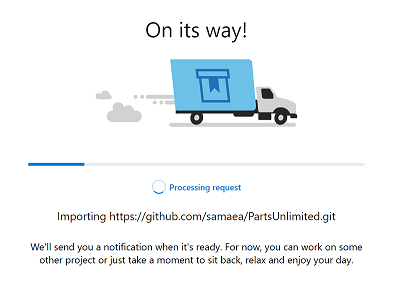
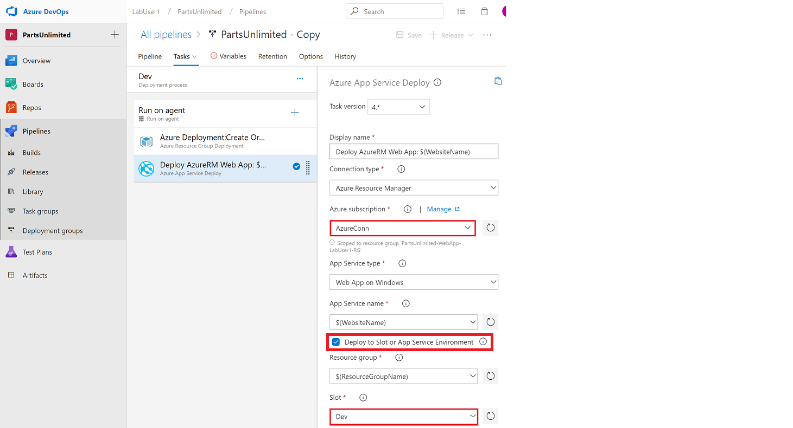

CI and CD with Azure DevOps - Quickstart
----------------------------------------

In this lab we have an application called PartsUnlimited. We want to set up Continuous Integration (CI) and Continuous Deployment (CD) with Azure DevOps (formerly Visual Studio Team Services (VSTS)). Continuous Integration builds the app and runs unit tests whenever code is pushed to the master branch. After the CI step succeeds it will trigger a deployment to a `dev` deployment slot. The `staging` slot and `production` will require an approver before the app is deployed into them. Once the approver confirms that `staging` slot is stable, the app will be deployed to the production site.

### Pre-requisites:

*   An active Azure DevOps account
    
*   Project Admin rights to the Azure devOps account
    
*   An account in Azure
    

### Lab Tasks:

*   Import Source Code into your Azure DevOps Account with Git
*   Create local git repo from your Azure Repos using a git repo
*   Set up Service Endpoint in Azure DevOps
*   Import Continuous Integration Build Definition into Azure Pipelines and kick off a build
*   Import Continuous Deployment release definition into Azure Pipelines
*   Export Build and Release Definitions from Azure Pipelines and commit changes to Azure repo to kick off CI and CD
*   Confirm successful deployment to Azure
*   (Optional) Make a change to PartsUnlimited website and see it being reflected back into Azure

### Estimated Lab Time:

*   approx. 80 minutes

### Task 1: Import Source Code into your Azure DevOps Account with Git

In order to use Build using Azure Pipelines and Azure Repos, you must contain the source code for the application. For this lab we are using a Git project. The next couple of steps will allow you to add the PartsUnlimited source to the Git master repository.

1.  If you haven’t already, go to [http://visualstudio.com](http://www.visualstudio.com) and create a new team project in your Azure DevOps (formerly Visual Studio Team Services (VSTS)) account that uses Git for source control. Click on **New**, enter project name, select **git** for **Version control** and click on **Create project** button. 

    * **Note**: If you have been provided with Lab credentials, please use those to login to Azure DevOps, where you will need to complete the initial setup, which will then take you directly to the new project DevOps page. These same credentials will be used to login to the Azure Portal at a later stage.
    
      
    
2.  Import the PartsUnlimited repo on GitHub by going to **Import a repository** and clicking **Import**
    
    
    
3.  Obtain the URL to clone by opening a new browser and going to the URL http://www.github.com/samaea/PartsUnlimited, then clicking the **Clone or Download** button then copying the URL by clicking **Copy to clipboard** until it says **Copied**
    
    
    
4.  Return to Azure DevOps and in the **Import a Git repository** dialogue you opened earlier enter the values
    
    *   Source type = Git
    *   Clone URL = https://github.com/samaea/PartsUnlimited.git
    
    
    
5.  Wait until the repo is imported and available in Azure Repos, you’ll see status and success messages, then be able to view the files as in the screenshots below.
    
    Note: You can return and access your project repo files at any time by going to **Code** > **Files**
    
    
    
    
    
    Congratulations, your code should now be in Azure DevOps.
    

### Task 2: Create local git repo from your Azure Repos

There are a number of ways to create a local git repo and there are a number of tools which you can use.

Firstly you need to install git in your local environment, see the page [1.5 Getting Started - Installing Git](https://git-scm.com/book/en/v2/Getting-Started-Installing-Git) for details on how to install git in your local environment.

The steps we outline below will be based on a Windows installation but you could also perform similar tasks on linux or mac if you needed using the git bash.

1.  Download and Install Git on your local machine by going to [https://git-scm.com/download](https://git-scm.com/download) and following the steps and prompts in the installation wizard.
    
    
    
2.  Once installed, create a local folder where you can place the repo files i.e. **C:\\Repo**
    
3.  Open **Git cmd** window (e.g. in Windows 10, click on the Start menu and search for the application called Git Bash) and go to the folder where you want to place the git Azure Repos files i.e. **C:\\repo** by running the command
    
         cd C:\Repo
        
    
4.  Return to Azure DevOps and in your project go to **Code** > **Files** and then click on **Clone**.
    
    
    
5.  Click the copy button to copy the URL to clone
    
    
    
    **Note**: In case you have created or modified your repo and are on any other branches, ensure you are on the master branch on your repo. If you have not modified or added to the repo it is fine to just take the default values.
    
6.  Return to your local git cmd and in the folder where you want to place the repo run the command. If you are prompted with crendentials, please use the same one you used to login to Azure DevOps. For Lab users, please continue to use the lab credentials throughout.
    
         git clone <the copied URL for your Azure DevOps repo>
        
    
    
    
    **Note**: A new folder named with your project name is created in your local repo folder and you will see your files within that folder. i.e. **C:\\Repo\\Parts-Unlimited**
    
    
    
7.  Go to the local folder and view the files present. You can now modify any of the Azure DevOps repo files locally and push any changes up to the Azure DevOps repo using the git commands, or variations on them. An easy change that can be made without affecting the application, is by adding or modifying some words in the README file located in the root of the PartsUnlimited folder. Afterwards, in Bash, navigate to the PartsUnlimited folder and then you can run the below bash commands to push your changes:
    
         git add *
         git commit -m "<description of your changes>"
         git push
        
    

### Task 3: Setting up Service Connection in Azure DevOps

Before we create a release pipeline, we will need to create a connection between Azure DevOps and our environment within Azure. This will then allow us to deploy our release pipeline into our resources over in Azure. 

   
1.  Click on the Project settings cog

    
    
2.  Click on Service connections and then on Azure Resource Manager
    
            
    
3.  * Select Service Principal Authentication
    * Connection Name: AzureConn
    * Scope Level: Subscription
    * For subscription, lab users need to select: "Microsoft Azure Internal Consumption". Otherwise, you would use your own Azure subscription.
    * For Resource group, lab users need to select "PartUnlimited-WebApp-LabUserX-RG" with X being your user number.
 
        
    
    
    
    

### Task 4: Import Continuous Integration Build pipeline definition into Azure DevOps and kick off a build

1.  Navigate to the **Pipelines > Builds** and click on _Builds_. There will be a message saying **No build pipelines were found**. We must create a build pipeline, before we have the option to import a build definition.
    
    
    
2.  Click on the hyperlink **use the visual designer**

    

3.  Click on **New Pipeline** accept the defaults and click **Continue**
    
    
    
4.  In the **Select a template** pane choose **Empty job**
    
    
    
5.  The click the arrow beside **Save & queue** and choose **Save**, clicking **Save** again in the Save build pipeline dialogue.
    
    
    
6.  Now click again on **Pipelines > Builds** and click on **\+ New** and choose **Import a pipeline**
    
    
    
7.  Click on **Browse** and go to your local repo which you created in Task 2, i.e. something like **C:\\Repo\\Parts-Unlimited** then go to the folder **templates\\build definitions** and select the file **PartsUnlimited-CI.json** and click on **Import** button.
    
    
    
8.  Once the import has done, you will need to update some information. Click on the **Pipeline** heading under **Tasks** and under Agent pool select **Hosted VS2017** in the hosted section. If this is already filled in please select the option with the **VS logo** beside it.
    
    
    
9.  Now go to **Get Sources** under **Tasks** and make sure that that the branch that has been selected is `master` and it is using this project.
    
    
    
10.  Now click **Save & queue**, and **Save & queue** again when prompted. This will kick off a build and you should see a message saying a build has been queued. You can click on the link provided to view the build progress. It should run and complete successfully, it may take up to 10 minutes to complete.
    
   
   
    

### Task 5: Import Continuous Deployment release pipeline definition into Azure DevOps and kick off Continuous deployment

Note: If you already have at least one release definition then skip to step 2, otherwise you are going to create one very quickly to be able to access the import a release option.

1.  Navigate to the **Pipelines > Releases**.Click on the **\+ New pipeline** button and in the **Select a template** pane, select **Empty job** . This will create an empty release pipeline with default settings. Click on **Save** and **OK**.
    
    
    
    
    
2.  Click on **Pipelines > Releases**, click on **+** button and select **Import release pipeline**.
    
    
    
3.  Click on **Browse** and select `PartsUnlimited.json.json` file in `templates\release definitions` of your local repository. Then click on **Import** button.
    
    
   
    
4.  Click **\+ Add an artifact** 
    
    and in the Add an artifact dialogue, select **Source Type** as **Build**, and then specify your the **Project** i.e. `Parts-Unlimted`, and specify the **Source** as your imported build pipeline i.e. `Parts-Unlimited-CI-import`, the **Source alias** will auto populate, and click **Add**
    
    
    
5.  Make sure that the **Continuous deployment trigger** is enabled, by selecting the lightning bolt to the top right of the artifact.
    
    
    
    and turning on the switch to enable Continuous deployment\*
    
    
    
6.  Everything that needs your attention will be listed in red.
    
    
    
7.  Go to **Tasks > Dev**, or click on **1 job, 2 tasks** in the pipeline graphical display, and select the **Agent Phase** you will see that **Agent pool** is in red. Select the **Hosted VS2017** option.
    
    Then complete these steps again for the **Staging** and **Prod** environments. You can access these environments by clicking on the **Tasks > Staging** and **Tasks > Prod** respectively.
    
    
    
8.  Now go back to **Tasks > Dev** and under the **Azure Deployment: Create or Update Resource Group….** task, you will need to update the **Azure subscription** to the Service connection that you specified earlier in **Task 3** i.e. Azure SP and the **Location**, you can specify the Azure DataCenter nearest to you.This **only** needs to be done in the **Dev** Task, as this task only exists under **Dev**.
    
    
    
9.  Under the **Azure App Service Deploy….** task, you will need to update the **Azure subscription** , again to the **service connection** value you created earlier in **Task 3**, and the **Slot**. For Slot you will need to enter the value **Dev**.
    
   This needs to also be done for the **Staging** task and the value to use there is **Staging** task. It does **not** need to be done for the **Prod** task, as leaving that value blank there means it will deploy to production and not to a slot.
    
   
    
   There should now be no more red highlighted section under **Tasks**
    
10.  Navigate back to the Pipeline and you will see some **pre-** and **post-** deployment conditions where you need to select the approvers for the **Staging** and **Prod** steps. Add your name as an approver to these.
    
   
    
11.  Select the **Variables** tab, followed by the **Pipeline variables**. The red highlighted issues here are the two **Password** values. You will need to select the **Lock** icon next to them and type in a new one, you can use the password of **Pa$$w0rd01** if you wish. For the rest of the values although not highlighted in **Red** you **must** change these also to be unique value by adding "labuserX" (with X being your lab user number) to the end of them. We are deploying live web services and this is to ensure naming values rae unique as required by the services.See the bullet notes below when determining the values required.
    
   
    
   **Note**: You just need to add your initials to the end of the current values, but you should be aware of the following in case it is needed.
    
   *   The parameter values need to adhere to requirements for the Azure resource they are deploying. If they do not meet those requirements you may receive an error when deploying.
   *   In general, if you try to make all values unique, lowercase and between the resource character limits, i.e. if you stay under 24 characters you should be fine.
   *   You should also **not** have an **underscore** or **dash** in the name, as during deployment some resources and object names are generated and will append names with other values with dashes and underscores, and as a result may give errors if used
12.  All errors should now have been addressed. Prior to this the **Save** option was not available, it was greyed out. However, now that there are no errors present, you can click **Save** to save the release.
    
   **Note**: If you had to define an empty release definition before, then it can be now deleted by clicking on the dropdown arrow next to the empty definition and selecting **Delete** if you wish to do so.
    
   
    
   Congratulations, you have imported a release definition successfully.
    

### Task 6: Export Build and Release Pipeline definitions from Azure DevOps

Now that you have configured build and release pipelines specifically for your repository in Azure DevOps, it’s a good idea to replace the given templates with your own.

1.  Navigate to **Pipelines > Builds**, click on your build pipeline definition i.e. **PartsUnlimited-CI-Import** and then click on the ellipsis **(…)** button next to tab options and select **Export**.
    
    This will trigger a download of the build definition in your browser in JSON format. Click **Save as** and place this file in the `templates\build definitions` directory of your local repository.i.e. **C:\\Repo\\Parts-Unlimited\\templates\\build definitions**, you can append your initials to it if you like or overwrite it, and verify it downloads successfully.
    
    
    
2.  Navigate to **Pipelines > Releases** and click on the **elipsis** option beside your release pipeline, i.e. Deployment and select **Export**.
    
    This will trigger a download of the release definition in JSON format. Click **Save as** and place this file in the `templates\release definitions` directory of your local repository.i.e. **C:\\Repo\\Parts-Unlimited\\templates\\release definitions**, you can append your initials to it if you like or overwrite it, and verify it downloads successfully.
    
    
    
3.  Open the git cmd window and go to your local repo location i.e. **C:\\Repo\\Parts-Unlimited**.
    
4.  Commit your changes using the following commands:
    
         git add .
        
    
    Stages all changes for the next commit
    
         git commit -m "added build and release definitions"
        
    
    Creates a commit from all current staged changes.
    
         git push
        
    
5.  This uploads commits to the Azure DevOps repository. Go to your Azure DevOps repo and verify the files have been pushed up to the Azure DevOps repo as expected.
    
    Congratulations, now you can reuse your templates with other projects or lab tasks if you wish.
    

### Task 7: Confirming successful deployment to Azure

The changes you have just committed will trigger a CI build and a deployment to Azure using your release pipeline.

1.  You can view the release pipeline progress by clicking on the release and viewing the pipeline progress, as per the below screenshots.
    
     
    
2.  Once the deployment to the **dev** slot is completed, the pre-approver for the **Staging** environment will receive an email notification about the pending deployment to the **staging** slot.
    
3.  To approve or cancel the request, In the release pipeline progress progress pane, click on the **Approve** or **cancel the deployment** button (circle with diagonal line through it) and choosing it again on the approval pane.
    
    
    
    **Note:** The **Staging** environment also has a post-approver who must confirm that the app is stable and ready for the production environment. The pre-approver for the **Production** environment must also confirm before this final deployment.
    
    
    
    Continue the approval processes until the release pipeline completes successfully.
    
    
    
4.  In Azure, find your App Service with the name of the web server you specified, and open its URL (this is the production site).
    
    
    
    **Note:** In the **Deployment slots** section you can find the **dev** and **staging** slots with their respective URLs.
    

Congratulations on successfully setting up Continuous Integration and Continuous Deployment with Azure DevOps.

### Task 8: (Optional) Make a change to PartsUnlimited website and see it being reflected back into Azure

This step is optional. If you are interested in making another change to your live website, you can make a change to the homepage.

Upon navigating to the App Service URL (as instructed in Task 7, step 4), you will notice there is an advert stating a 20% off on tires. We will now change this to 40% instead.

   

1.  In Azure DevOps, click on Azure Repo -> Files. In the repo, navigate to src/PartsUnlimitedWebsite/Views/Home/Index.cshtml.

2. Click on Edit, on the 30th line, change "20%" to "40%" and click Save.

    
    
3. The Build/Release cycle will now execute automatically as you have CI/CD enabled. You can now monitor your build by navigating to Azure Pipelines -> Builds.

    

4. View the release pipeline and perform the approval process, identical to what was done in Task 7.

5. Once the release was successful, navigating back to the App Service URL to view the change.

6. Well done!

    

### Summary

In this lab, you have learned how to push new code to Azure DevOps, set up a Git repo, create a Continuous Integration build that runs when new commits are pushed to the master branch and create a Continuous Deployment that deploys an application to environments automatically. This allows you to receive feedback as to whether your changes contain syntactical errors or break existing tests, as well as saving time by automating the deployment process.

To learn more in-depth information about CI and CD try out these labs:

*   [Continuous Integration with Visual Studio Team Services](https://microsoft.github.io/PartsUnlimited/cicd/200.3x-CICD-M01-CIwithVSTS.html)
*   [Continuous Deployment with Visual Studio Team Services](https://microsoft.github.io/PartsUnlimited/cicd/200.3x-CICD-M03-CDwithVSTS.html)

Documentation for [PartsUnlimited](https://github.com/Microsoft/PartsUnlimited)
